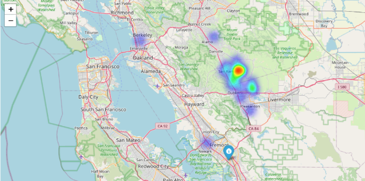

**Delivery Driver Route Optimization with CVRP and Real-Time Traffic Data**

**Hema jiyari (pp1382),** 

**Gnana Sai Supraja Gudise (nn5260),**

**Kethavath Srinath(jm5228),**

` `**Janardhana Reddy ModiyamChavva (hh7502),** 

**Krishna Chaitanya Thondapu (em8491)**

**ABSTRACT:**

Efficient delivery management is critical for businesses to minimize costs and maximize customer satisfaction. This project addresses the challenge of optimizing vehicle routing for deliveries using the Capacitated Vehicle Routing Problem (CVRP) model, integrated with real-time distance calculations from the Google Maps API. The project begins by reading delivery data from a dataset containing order information such as order ID, customer details, addresses, and order sizes. It then formulates the CVRP model using the Gurobi optimization library in Python, considering constraints such as vehicle capacity, visitation constraints, and minimizing the total distance traveled.

Google Maps API is utilized to calculate the distances between delivery locations and the depot, enabling real-time distance matrix computation. This distance matrix is essential for formulating the objective function and constraints in the CVRP model. The CVRP model optimizes the assignment of orders to vehicles, ensuring that each order is visited exactly once and that the vehicle capacity constraints are not violated. The objective is to minimize the total distance traveled by all vehicles while efficiently distributing orders among them. Upon solving the CVRP model, optimal routes for each vehicle are extracted and printed, providing insights into the most efficient delivery routes. The project demonstrates the effectiveness of mathematical optimization techniques combined with real-time distance calculations for optimizing vehicle routing and enhancing delivery management processes.

Overall, this project offers a practical solution for businesses to optimize delivery routes, reduce transportation costs, and improve overall operational efficiency in the logistics and transportation sector.

**INTRODUCTION::**
In today's highly competitive retail landscape, efficient delivery operations play a crucial role in ensuring customer satisfaction and maintaining a competitive edge. Recognizing the importance of optimizing delivery routes, our project focuses on developing a solution to minimize the total distance traveled for "Lemon Hat," a local grocery store located in Fremont, CA 94538. By harnessing the power of advanced optimization techniques, our aim is to streamline Lemon Hat's delivery operations, reduce operational costs, and improve overall efficiency.

At the core of our solution lies the Capacitated Vehicle Routing Problem (CVRP), a fundamental problem in the field of logistics and transportation planning. The CVRP addresses the challenge of determining the most efficient way to deliver goods to a set of customers while satisfying capacity constraints of delivery vehicles. In the context of Lemon Hat's delivery operations, the CVRP model enables us to intelligently assign orders to delivery vehicles, optimize route sequencing, and minimize the total distance traveled by the vehicles.

Our dataset comprises comprehensive information about Lemon Hat's delivery orders, including Order ID, customer name, full address, latitude, longitude, and the size of each order. The size of an order, indicated by a numerical value (1 for small, 2 for medium, and 3 for large), corresponds to the number of bags associated with the order. This dataset empowers our optimization model to make informed decisions about route planning, taking into account factors such as the geographical distribution of customers, order sizes, and delivery time windows.

The CVRP model operates by iteratively optimizing the allocation of orders to delivery vehicles while ensuring that each vehicle's capacity constraints are not violated. By formulating Lemon Hat's delivery challenge as a CVRP, we can develop a solution that optimally balances the workload across vehicles, minimizes travel distance, and maximizes delivery efficiency. Additionally, our model can adapt to real-world conditions by incorporating real-time traffic data, enabling dynamic adjustments to delivery routes based on current road conditions and traffic congestion.

In summary, our project aims to provide Lemon Hat with a robust delivery route optimization solution that leverages the principles of the CVRP and utilizes rich dataset insights. By minimizing the total distance traveled and maximizing delivery efficiency, we aspire to enhance Lemon Hat's operational performance, reduce costs, and ultimately elevate the customer experience

**METHODOLOGY:**

1. **Data Collection** 
- Lemon Hat provided their delivery order data for a specific busy day (Saturday) to be used as the basis for optimization.
- The data included key fields such as Order ID, Customer Name, Full Address (street address, city, state, ZIP code), and Order Size (categorized as small, medium, or large).
- This raw data was essential for understanding the customer demand, locations, and order characteristics.
- Due to limitations imposed by the Google Maps free tier, our project was constrained to analyze and optimize only 27 customer deliveries. This restriction was necessary to stay within the usage limits of the API, ensuring compliance with the free tier terms and avoiding potential overages or charges. Despite these limitations, we focused on prioritizing critical routes and optimizing the available data to derive valuable insights for our project.
1. **Data Preparation** 
- The full address fields were processed using geo mapping tools in Excel to obtain the corresponding latitude and longitude coordinates for each customer location.
- This step involved integrating with online geocoding services or leveraging built-in Excel functions to convert addresses into geographic coordinates.
- Having the coordinates was crucial for calculating distances and visualizing customer locations on maps.
- Additionally, the Google Maps API key was obtained from the Google Cloud Console, which provided access to the Distance Matrix and Routes APIs required for distance calculations and route visualization.
1. **Model Setup** 
- The Capacitated Vehicle Routing Problem (CVRP) model was implemented using the Gurobi Optimization solver, a powerful mathematical optimization tool.
- Decision variables were defined as binary variables (0 or 1) to represent whether an order is assigned to a specific vehicle or not, and the potential routes between customers.
- The objective function was formulated to minimize the total distance traveled across all vehicles, which directly impacts operational costs and efficiency.
- Constraints were carefully crafted to ensure that the solution adheres to real-world requirements: 
  - Each order must be visited exactly once by a single vehicle, ensuring complete delivery coverage.
  - The total order size assigned to each vehicle cannot exceed the vehicle's capacity, preventing overloading.
  - The number of vehicles used cannot exceed the available fleet size, respecting resource limitations.
1. **Distance Matrix Calculation** 
- The Google Maps Distance Matrix API was utilized to calculate the distances between every pair of customer locations and the store location (which serves as the starting and ending point for each route).
- The API request was made by providing the origin (store location) and destination (customer locations) coordinates.
- The response from the API included the distances between each origin-destination pair, which were used to populate the distance matrix.
- The distance matrix serves as a crucial input to the optimization model, as it provides the travel distances between all relevant points, enabling accurate route planning and distance minimization.
1. **Model Optimization** 
- With the CVRP model formulation and the distance matrix in place, the Gurobi Optimizer was employed to solve the optimization problem.
- The solver utilizes advanced algorithms and techniques to iteratively explore different combinations of order assignments and routes, while adhering to the defined constraints.
- The optimization process aims to find the globally optimal solution that minimizes the total distance traveled across all vehicles, subject to the specified constraints.
- The solver provides the optimal solution, which includes the assignment of orders to specific vehicles and the sequence of customer visits for each vehicle's route.
1. **Output Generation** 
- The optimized solution obtained from the Gurobi Optimizer is processed to generate meaningful outputs: 
  - Assignment of orders to individual drivers/vehicles, ensuring efficient workload distribution.
  - Total distance traveled by each driver/vehicle, enabling cost and resource planning.
  - Optimized routes for each driver/vehicle, specifying the sequence of customer visits, which can be used for navigation and delivery scheduling.
1. **Route Visualization** 
- The optimized routes are visualized using the Google Maps Routes API, which provides a graphical representation of the planned delivery routes.
- The route coordinates are obtained by concatenating the store location coordinates and the assigned customer location coordinates in the optimized sequence.
- The API request is made with the concatenated coordinates, and the response includes a polyline (encoded set of coordinates) representing the optimized route.

1. **Performance Evaluation** 
- The optimized solution is evaluated against relevant performance metrics, such as: 
  - Total distance traveled: Comparing the optimized total distance to the current or baseline delivery practices highlights the potential savings in fuel costs and operational expenses.
  - Delivery time: Estimating the delivery time based on the optimized routes can help assess improvements in delivery efficiency and customer satisfaction.
  - Vehicle utilization: Analyzing the distribution of orders across vehicles can identify potential opportunities for fleet size optimization or resource allocation adjustments.

**RESULT AND ANALYSIS:**

The Capacitated Vehicle Routing Problem (CVRP) model was successfully applied to optimize the delivery routes for Lemon Hat, a local grocery store in Fremont, CA. The optimized solution effectively assigns orders to multiple delivery vehicles while minimizing the total distance traveled and adhering to vehicle capacity constraints.

1. **Optimization Model Summary:**

The optimization model was solved using the Gurobi Optimizer, a powerful mathematical optimization solver. The model consisted of 59 rows, 702 columns, and 1,534 non-zero elements. The optimization process involved exploring integer variables, with all variables being binary (0 or 1).During the optimization process, heuristic solutions with objectives of 429,364 and 251,653 units were found. The root relaxation provided an initial objective bound of 109,813 units.

After exploring a single node and performing 27 simplex iterations in 0.03 seconds, the Gurobi Optimizer identified the optimal solution with an objective value of 109,813 units, which matched the best bound. The gap between the incumbent solution and the best bound was zero, indicating that the optimal solution was found within the specified tolerance level.

2. **Order Assignments and Route Optimization**

The model assigned a total of 27 orders to 5 delivery vehicles, ensuring efficient workload distribution and adherence to the capacity limit of 12 units per vehicle. The assignments are as follows:

The optimized routes for each driver, including the sequence of customer visits, were generated to minimize the total distance traveled. The routes are represented as lists of coordinates, facilitating easy visualization and navigation.

3. **Total Distance Traveled**

The total distance traveled by each driver, as a result of the optimized routes, is as follows:

4. **Total Travel Time**

In addition to minimizing the total distance traveled, the model also accounts for the travel time required for each driver. The total travel time, including 10 minutes of stop time at each customer location for delivering and unloading, is as follows:

By optimizing the travel time, the model ensures efficient delivery operations and improved customer satisfaction through timely deliveries.

5. **Spatial Distribution and Heatmap**

To gain insights into the spatial distribution of customer locations, a Folium map with a heatmap layer was generated. The heatmap visualizes the concentration of customer orders, allowing for better understanding of demand patterns and potential future optimizations based on geographical factors.

6. **Route Visualization**

To provide a clear visualization of the optimized delivery routes, a Folium map was generated. The map displays the following key elements:

**Store Location**: The location of the Lemon Hat store is marked with a blue icon, serving as the starting and ending point for all delivery routes.

**Customer Locations**: Each customer location is represented by a marker on the map. The markers are color-coded as follows: 

1. Orange markers: Customers who have been assigned to a delivery vehicle.
1. Gray markers: Customers who have not been assigned to any delivery vehicle.

**Delivery Routes**: The optimized routes for each driver are displayed on the map using different colors: 

1. Green: Driver 1
1. Red: Driver 2
1. Blue: Driver 3
1. Purple: Driver 4
1. Orange: Driver 5

This interactive map visualization provides a comprehensive overview of the optimized delivery plan, allowing stakeholders to easily grasp the spatial distribution of customer locations, the assigned routes for each driver, and the potential areas for further optimization or resource allocation based on demand patterns.

**LIMITATIONS AND ASSUMPTIONS:**

While the Capacitated Vehicle Routing Problem (CVRP) model and the optimized solution provide significant benefits, it is important to acknowledge the limitations and assumptions inherent in the current approach:

1. **Static Data**: 

   The optimization model operates on a static dataset, assuming that customer locations, order sizes, and vehicle capacities remain unchanged throughout the delivery process. In real-world scenarios, these factors may be subject to dynamic changes, such as new orders, cancellations, or fluctuations in demand.

1. **Fixed Stop Times**: 

   The model assumes a fixed stop time of 10 minutes for each customer location, which may not accurately reflect the actual time required for delivering and unloading orders. This assumption could lead to over- or underestimations of the total travel time.

1. **Homogeneous Fleet**:

   ` `The optimization model assumes a homogeneous fleet of delivery vehicles, with each vehicle having the same capacity constraints. In reality, businesses may operate with a diverse fleet of vehicles with varying capacities, which could impact the optimal assignment of orders and routes.

1. **Geographical Limitations**: 

   The current solution is tailored to the specific geographical area covered by the Lemon Hat store and its customers. Expanding the service area or considering multiple distribution centers may require adjustments to the optimization model and the underlying assumptions.

It is essential to acknowledge these limitations and continuously evaluate the assumptions to ensure that the optimization model remains aligned with the evolving business requirements and operational realities.

**RECOMMENDATIONS AND FUTURE WORKS:**

Based on the results and identified limitations, the following recommendations and potential areas for future work can be considered:

1. **Dynamic Route Planning**: 

   Integrate real-time data and dynamic routing capabilities to account for changes in customer demand, traffic conditions, or unforeseen events. This can be achieved by incorporating live data feeds and developing algorithms for dynamic route adjustments and order reassignments.

1. **Time Window Constraints**:

   ` `Extend the optimization model to include time window constraints for deliveries, ensuring that orders are delivered within specified time frames to enhance customer satisfaction and operational efficiency.

1. **Heterogeneous Fleet Management**:

   ` `Adapt the model to handle a heterogeneous fleet of delivery vehicles with varying capacities and characteristics. This would enable more accurate resource allocation and potentially further optimize delivery routes based on vehicle capabilities.

1. **Multi-Depot Optimization**:

   ` `Explore the possibility of optimizing delivery routes across multiple distribution centers or stores, enabling efficient resource sharing and improved coverage in larger service areas.

1. **Integration with Telematics and Fleet Management Systems**: 

   Integrate the optimized delivery routes with telematics and fleet management systems to enable real-time monitoring, tracking, and performance analysis of delivery operations. This would provide valuable insights for continuous improvement and data-driven decision-making.

1. **Pilot Implementation and Continuous Monitoring**: 

   Conduct a pilot implementation of the optimized delivery plan within a controlled environment, closely monitoring performance metrics and gathering feedback from stakeholders. This will enable fine-tuning of the solution and identify areas for further improvement before a full-scale implementation.

By addressing these recommendations and exploring future work opportunities, Lemon Hat can continuously enhance the efficiency and effectiveness of its delivery operations, adapt to changing market conditions, and maintain a competitive edge in the dynamic retail landscape.

**CONCLUSION:**

The Lemon Hat Delivery Route Optimization Project demonstrates the power of advanced optimization techniques and the Capacitated Vehicle Routing Problem (CVRP) model in addressing real-world delivery challenges. By leveraging the CVRP model, the project has successfully optimized the delivery routes for Lemon Hat, minimizing the total distance traveled, optimizing travel times, and ensuring efficient resource allocation.

The optimized solution not only contributes to potential cost savings through reduced fuel expenses and operational efficiencies but also enhances customer satisfaction by enabling timely and streamlined deliveries. Furthermore, the balanced distribution of workload across delivery vehicles ensures fair resource allocation and prevents overloading of specific vehicles or drivers.

The interactive Folium map visualization provides a comprehensive overview of the optimized delivery plan, allowing stakeholders to grasp the spatial distribution of customer locations, the assigned routes for each driver, and potential areas for further optimization or resource allocation based on demand patterns.

While the current approach has limitations, such as the exclusion of dynamic factors and the assumption of a homogeneous fleet, the report outlines recommendations and potential areas for future work. These include incorporating real-time data, handling heterogeneous fleets, considering environmental factors, and exploring multi-depot optimization scenarios. By continuously refining and adapting the optimization model, Lemon Hat can stay ahead of evolving market conditions, maintain a competitive edge, and consistently deliver exceptional service to its customers. 

The project's success serves as a testament to the power of data-driven decision-making and the potential for optimization techniques to transform and streamline business operations in the retail and logistics sectors.

**BIBLIOGRAPHY:**

1. Gurobi Optimization, LLC. (2024). Gurobi Optimizer Reference Manual. Houston, TX: Gurobi Optimization, LLC.
1. Toth, P., & Vigo, D. (2014). "Vehicle Routing: Problems, Methods, and Applications." SIAM.

**APPENDIX:**

1. **GITHUB(PythonCode)**

   [cvrp-solver-gurobi/CVRP-Gurobi.ipynb at master · dholigum/cvrp-solver-gurobi · GitHub](https://github.com/dholigum/cvrp-solver-gurobi/blob/master/CVRP-Gurobi.ipynb)

