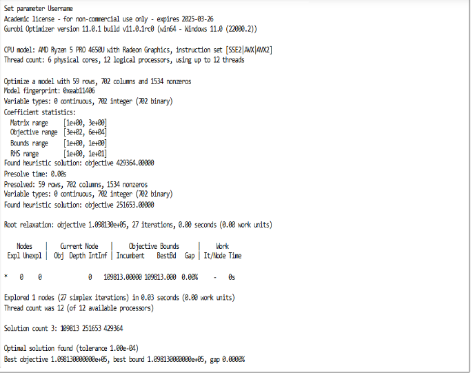
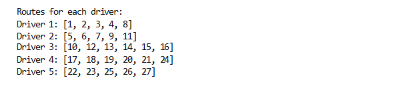
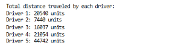
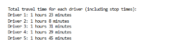
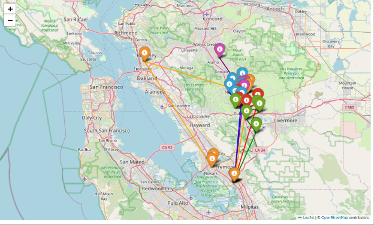

# Delivery Driver Route Optimization with CVRP and Real-Time Traffic Data

## Objective
- Calculate route travel
- Optimize the total time travelled
- Solver map visualization
- Real-world map integration

## Mathematical Model
- **CVRP Mathematical Model**

  

## How to use

1. Clone this repo
2. Install depedencies `pip install -r requirements.txt`
3. Import your dataset into this project directory
4. Open `CVRP-Gurobi.ipynb` files
5. Edit cells with your dataset
6. Add your own OpenRouteServices API Key

## Results and analysis

 

**Total Distance Traveled**

**Total Travel Time**

**Route Visualization**

